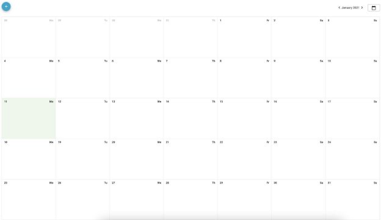
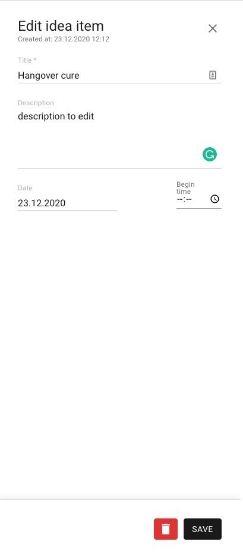

Додаток - Календар подій. Новий користувач додатку

1. Заходить на сторінку додатку та бачить сторінку, яка складається з:

-   Кнопка відкриття форми.
-   Фільтр за датою. За замовчанням вибрано поточний місяць.
-   Сітка календаря вибраного у фільтрі місяця. Складається із днів (ячеєк). Ячейка включає:
    -   Номер дня місяця (1, 2, 3)
    -   День тижня
    -   Список подій

Ячейка яка відповідає поточному дню - візуально виділена.

Референс сторінки

2. Фільтр за датою

-   кнопки “<” и “>” змінюють місяць циклічно
-   кнопка календаря відкриває date picker c можливість вибрати рік та місяць

3. Створення події

-   клік по кнопці створення подій
-   відкриється незаповнена форма. Форма складається з 3 полів:
    -   Title (required)
    -   Description
    -   Date (required)
    -   Time

-   Кнопка “Save” зберігає та закриває форму

4. Редагування/видалення подій

-   Клік події відкриває заповнену форму в режимі редагування. На формі є created at/ updated at
-   кнопка “save” оновлює подію та закриває форму
-   кнопка “save” оновлює подію та закриває форму

Вимоги:

1. Не використовуйте готові календарі.
1. Додаток зберігає стан фільтрів після перезавантаження сторінки
1. Додаток використовує localstorage як сховище даних. Передбачити заміну реалізації зберігання, наприклад REST API (не реалізовувати).
1. Додаток може візуально відрізнятися від прикладених референсів
